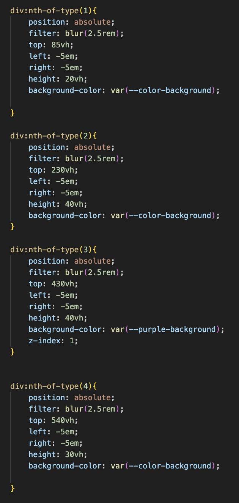

# Procesverslag
Markdown is een simpele manier om HTML te schrijven.  
Markdown cheat cheet: [Hulp bij het schrijven van Markdown](https://github.com/adam-p/markdown-here/wiki/Markdown-Cheatsheet).

Nb. De standaardstructuur en de spartaanse opmaak van de README.md zijn helemaal prima. Het gaat om de inhoud van je procesverslag. Besteedt de tijd voor pracht en praal aan je website.

Nb. Door *open* toe te voegen aan een *details* element kun je deze standaard open zetten. Fijn om dat steeds voor de relevante stuk(ken) te doen.

## Jij

  
uitwerken voor kick-off werkgroep

  ### Auteur:
 Joep Groenteman

  #### Je startniveau:
  Blauw

  #### Je focus:
  responsive
 

## Je website

  
uitwerken voor kick-off werkgroep

  ### Je opdracht:
  [link naar de website die je gaat namaken óf de naam/omschrijving van je eigen ontwerp
](https://ilovem83.com/)
  #### Screenshot(s) van de eerste pagina (small screen): 
 Home page  

  #### Screenshot(s) van de tweede pagina (small screen):
  Music page
 

 

## Toegankelijkheidstest 1/2 (week 1)

  
uitwerken na test in 2e werkgroep

  ### Bevindingen
  Lijst met je bevindingen die in de test naar voren kwamen:

  Uit de toegankelijkheidstest is gekomen dat de website op alles behalve 'media' en 'controls' goed scoort. Op 'media' scoort de website niet goed genoeg, omdat er geen transcript captions zijn. En op 'controls' is niet goed gescoort omdat je niet goed met je toetsenbrod door de pagina heen kan gaan. 
Wat ik zelf merk ik dat de webstite op sommige punten een goede scoren heeft, maar dat niet betekent dat het makkelijk/goed te gebruiken is. Ik vind de website zelf niet toeghankelijk genoeg. Je krijgt als je op de pagina komt meteen een pagina vullende video te zien waar je alleen uit kan komen als je je muis gebruikt. En de screenreader lees niet alles op. En wanneer die wat voorleest onder op de pagina blijft de pagina boven aan hangen. 

## Breakdownschets (week 1)

  
uitwerken na afloop 3e werkgroep

  ### de hele pagina: 
  

   

 

## Voortgang 1 (week 2)

  
uitwerken voor 1e voortgang

  ### Stand van zaken
-  Mijn vanila HTML was af voor het gesprek. Er klopte alleen niet veel van, omdat ik te veel keek naar de code van de website zelf ipv dat ik zelf ging bedenken waar wat staat en wat het precies was. 

  ### Agenda voor meeting
  samen met je groepje opstellen

  Mijn groepje kwam (bijna) geen gesprek opdagen. Ik was elke keer alleen 

  ### Verslag van meeting
  hier na afloop snel de uitkomsten van de meeting vastleggen

  - Ik moet niet kijken naar de code van de website zelf, omdat daar niks van klopte.
  - Het is beter om eerst de oefeningen te maken en daarna aan de website te beginnen

## Voortgang 2 (week 3)

  
uitwerken voor 2e voortgang

  ### Stand van zaken
  - Ik heb een begin aan mijn CSS gemaakt. 
  - Het gaat al beter dan vorig jaar doordat ik bijvoorbeeld 'root' gebruik.
  - mijn CSS begin nu wel al een beetje chaotisch te worden
  

  ### Agenda voor meeting
  samen met je groepje opstellen

Mijn groepje was er weer niet

  ### Verslag van meeting
  hier na afloop snel de uitkomsten van de meeting vastleggen

  - Ik moet niet te veel focusen op details, zoals een blur tussen afbeeldingen en achtergrond. 
  Het is beter als ik eerst zorg dat de basis goed is. 
  - Ik moet goed mijn readme blijven oploaden, omdat het leek alsof ik niks had gedaan
  - voor de rest liep ik niet echt tegen dingen aan. 
  - Mijn font was nog Times New Roman. Ik ga een beter font uitzoeken wat meer bij de website past. 

## Toegankelijkheidstest 2/2 (week 4)

  
uitwerken na test in 9e werkgroep

  ### Bevindingen
  Lijst met je bevindingen die in de test naar voren kwamen (geef ook aan wat er verbeterd is):

  - De headers werden heel onlogisch gebruikt. Er was geen h1. Het ging van h3 naar h2 naar h3. Ik heb de headers zoals het hoort gedaan: h1 > h2 > h3 etc
  - De video wanneer je de website opkwam was niet op pauze te zetten.
  - Er was geen foccus state.
  - Je kon niet met je Tab door de website gaan.
  - Als je de site op je telefoon horizontaal bekeek kwam er empty space links en rechts
  - Video kunnen niet op pauze worden gezet.

## Voortgang 3 (week 4)

  
uitwerken voor 3e voortgang

  ### Stand van zaken
  - wat goed ging is dat mijn site responsive was
  - Mijn logo ging alleen niet helemaal goed als mijn scherm te breed ging. Ik had er een max height op gezet wat niet nodig was.
  - Mijn CSS begint al groter te worden, maar ik ben bang dat die te groot is

 

  ### Agenda voor meeting
  samen met je groepje opstellen

  | student 1      | student 2          | student 3    | student 4        |
  | ---            | ---                | ---          | ---              |
  | dit bespreken  | en dit             | en ik dit    | en dan ik dat    |
  | en dat ook nog | dit als er tijd is | nog een punt | dit wil ik zeker |
  | ...            | ...                | ...          | ...              |

  ### Verslag van meeting
  hier na afloop snel de uitkomsten van de meeting vastleggen

  -Mijn CSS is niet te groot. Je CSS kan bijna nooit te groot zijn, maar je moet zorgen dat er  niks onnodigs in staat en dat het goed georganiseerd is.

## Eindgesprek (week 5)

  
uitwerken voor eindgesprek

  ### Je uitkomst - karakteristiek screenshots:
  

  ### Dit ging goed/Heb ik geleerd: 

- Al mijn code is W3S valid. Alle twee mijn css en html

- mijn website is responvive. en ik heb geleerd hoe ik media query's gebruik

- Ik heb geleerd hoe ik mijn code efficienter kan maken door bijvoorbeeld ':root' te gebruiken. Dit heeft mij veel tijd bespaard.

- Ik heb ook geleerd heo ik animaties moet maken. Hier wil ik wel meer over leren. 

  ### Dit was lastig/Is niet gelukt:
- Ik wilde net zoals de M83 website een blur maken tussen de verschillende achtergronden. Ik heb verschillende dingen geprobeerd zoals en div met position absolute, maar dit werkte niet omdat ik het positioneren nog niet goed genoeg onde de knie had. Als ik meer tijd had wilde ik dit ook toevoegen

- Wat ik ook wilde toevoegen was de video die afspeel wanneer je de m83 website opent. Ik heb dit uiteindelijk niet gedaan, omdat dit te veel werk was om toeghankelijk te maken. Als ik dit toevoegde had het meer nadelen dan voordelen voor mijn website.

- Wanneer ik de screenreader gebruik leest die eerst de navigatie op terwijl die verstopt is. Dit kan opgelost worden door een skip button of door de navigatie te verplaatsen naar de footer, maar hier heb ik nog geen tijd voor gehad. 

## Bronnenlijst

  
continu bijhouden terwijl je werkt

  Nb. Wees specifiek ('css-tricks' als bron is bijv. niet specifiek genoeg). 
  Nb. ChatGpT en andere AI horen er ook bij.
  Nb. Vermeld de bronnen ook in je code.

  1. SVG laten maken door chatGTP
		prompt: "maak een simpele hamburger menu svg"
    <svg
			aria-hidden="true"
			aria-label="hamburger menu"
			width="100" height="100" 
			viewBox="0 0 24 24" 
			stroke="currentColor" 
			stroke-width="2" 
			stroke-linecap="round" 
			stroke-linejoin="round">
			<line x1="3" y1="6" x2="21" y2="6" />
			<line x1="3" y1="12" x2="21" y2="12" />
			<line x1="3" y1="18" x2="21" y2="18" />
		</svg> 
  2. SVG van chatGTP
		 promt "maak een close button svg aub"
     <svg 
     xmlns="http://www.w3.org/2000/svg" width="50" height="50" viewBox="0 0 50 50" aria-label="close button">
			<line x1="10" y1="10" x2="40" y2="40"  stroke-width="5" stroke-linecap="round"/>
			<line x1="10" y1="40" x2="40" y2="10"  stroke-width="5" stroke-linecap="round"/>
		  </svg>

  3. socail media email icons van de m83 website

  4.  svg van chatGTP Prompt: Maak een Min SVG

  <svg 
  xmlns="http://www.w3.org/2000/svg" width="24" height="24" viewBox="0 0 24 24" fill="none" stroke="currentColor" stroke-width="2" stroke-linecap="round" stroke-linejoin="round" aria-label="plus">
  < line x1="5" y1="12" x2="19" y2="12"></line>
  </svg>

5. svg van chatGTP Prompt: Maak een PLuus SVG 
svg
 xmlns="http://www.w3.org/2000/svg" width="24" height="24" viewBox="0 0 24 24" fill="none" stroke="currentColor" stroke-width="2" stroke-linecap="round" stroke-linejoin="round" aria-label="minus">
  < line x1="12" y1="5" x2="12" y2="19"></line>
  < line x1="5" y1="12" x2="19" y2="12"></line>
  </svg>

6. svg van chatGTP  Prompt: Maak een hart SVG
                      
svg xmlns="http://www.w3.org/2000/svg" width="100" height="100" viewBox="0 0 24 24" fill="none" stroke="currentColor" stroke-width="2" stroke-linecap="round" stroke-linejoin="round" aria-label="heart icon">
< path d="M12 21C12 21 4 13.8 4 8.4C4 5.5 6.2 3.3 9 3.3C10.7 3.3 12 4.5 12 4.5C12 4.5 13.3 3.3 15 3.3C17.8 3.3 20 5.5 20 8.4C20 13.8 12 21 12 21Z"/>
</svg>

7. Betaal methodes SVG's van de m83 webs

